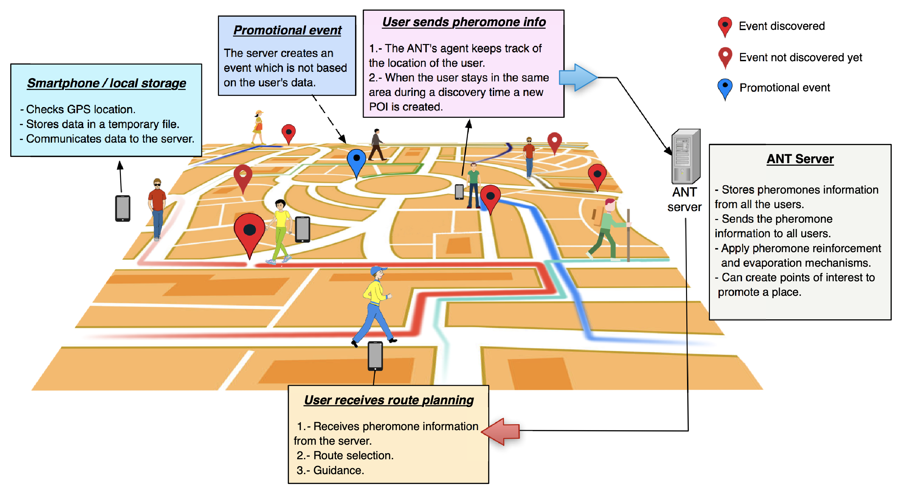
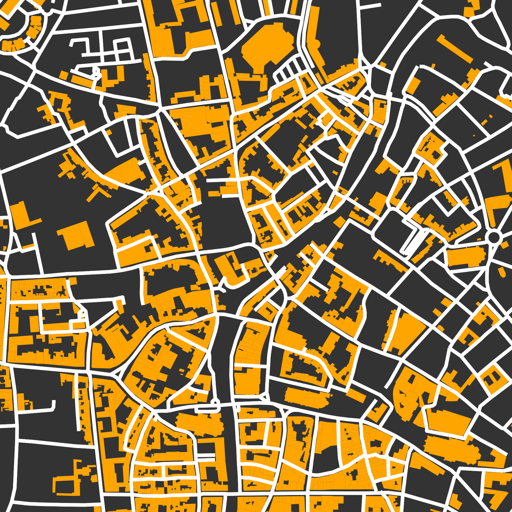

# Stigmergy-Based Tourist Navigation System
This repository contains the materials used in the study 

Pablo López-Matencio, Javier Vales-Alonso, and Enrique Costa-Montenegro, “ANT: Agent Stigmergy-Based IoT-Network for Enhanced Tourist Mobility,” *Mobile Information Systems*, vol. 2017, Article ID 1328127, 15 pages, 2017. https://doi.org/10.1155/2017/1328127

**Pablo López-Matencio, Javier Vales-Alonso, and Enrique Costa-Montenegro**,  
“ANT: Agent Stigmergy-Based IoT-Network for Enhanced Tourist Mobility,”  
*Mobile Information Systems*, vol. 2017, Article ID 1328127, 15 pages, 2017.  
[https://doi.org/10.1155/2017/1328127](https://doi.org/10.1155/2017/1328127)

The goal of this work is to study stigmergy as a way to collectively help tourists to discover points of interests, POIs, and find routes to those sites.
Stigmergy is the type of communication used used by some spieces of insects, e.g. ants, for foraging purposes. The insect liberates chemicals denominated *pheromones* that other individuals can sense. Stigmergy can be applied  to solve complex problems in real world scenarios, such as tourist routing.

## Operation overview

<!--    -->

  
  
<b>Figure 1:</b> System overview.

<!--    -->

Pheromone mapping determines a tourist's route based on different strategies with the following rules:

1. **Without pheromone**, a tourist chooses their path freely, with no influence from other agents.
2. **ANT software** tracks the tourist's path for a set **Memory Path Interval (MPI)**.
3. When a tourist stays at a location during a **POI Detection Interval (POI-DI)**, the system declares it a POI and sends the **Route Information (RI)** to the server, considering **POI Area Distance (POI-AD)** to trigger the POI.
4. The server checks if the POI is new by comparing it with nearby declared POIs. If new, a **POI Unique Number (POI-UN)** is created. The server adds pheromone to the RI based on route ranking.
5. Every **Updating Period (UP)**, the server evaporates pheromone at a predefined rate. If a POI's pheromone disappears, its information is removed.
6. The server provides tourists with an **Individualized Pheromone Mapping (IPM)**, which is unique to each tourist and guides them towards unvisited POIs.
7. The **ANT agent** uses the IPM to select routes, often leading to popular unvisited POIs.
8. The system also records and submits path data during special events, allowing new POIs to be declared for temporary locations.

## Simulations
We have constructed a simulator with Netlogo [1] environment, which is particularly well suited for modeling complex systems (e.g., natural and social phenomena) developing over time. 

The simulator file **gis-din-rank7.nlogo** above and can be opened with Netlogo. 

Netlogo can import ESRI shapefiles (.shp) vector files allowing the simulation of \emph{walker} agents over a map.

For our trials, we chose the town center of Ghent (Belgium).
Ghent is a touristic place with many visiting sites, such as old buildings and museums, and, like many old towns has an entangled net of walk-roads, making it a suitable example due to its complexity.
For our purposes, we used a *squared* area 
of N, S, E, W each $525$ m from location point $51.05660$ N, $3.721500$ E. 

  
  
<b>Figure 2:</b> Simulation map (Ghent, Belgium).

represents a map with walk-roads and building footprint of this area, obtained with the OSMnx [2] Python module.

The simulator implements three routing ranking methodologies for the mobility of tourists: 
- Fitness Proportionate Selection (FPS),
- Rank Selection (RS) and
- Gradient Based (GB).
  
They use pheromone deposited when other agents make a POI discovery to make mobility decisions probabilistically.

## References
[1]: U. Wilensky, *Netlogo. Center for Connected Learning and Computer-Based Modeling*, Northwestern University, Evanston, IL., USA, 1999. [URL](https://ccl.northwestern.edu/netlogo/)

[2]: G.Boeing,''OSMnx:New methods for acquiring,constructing, analyzing, and visualizing complex street networks'', *Computers, Environment and Urban Systems*, vol. 65, pp. 126–139, 2017. [URL](https://osmnx.readthedocs.io/en/stable/)
